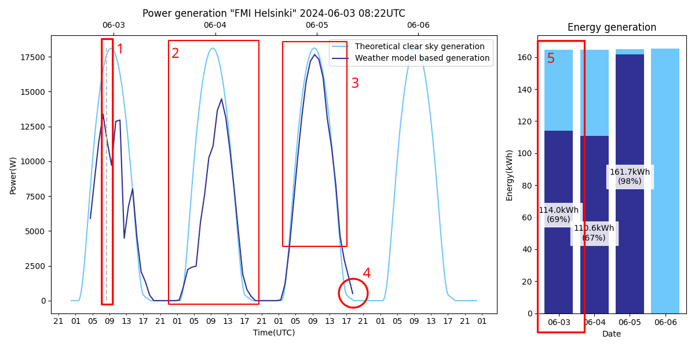
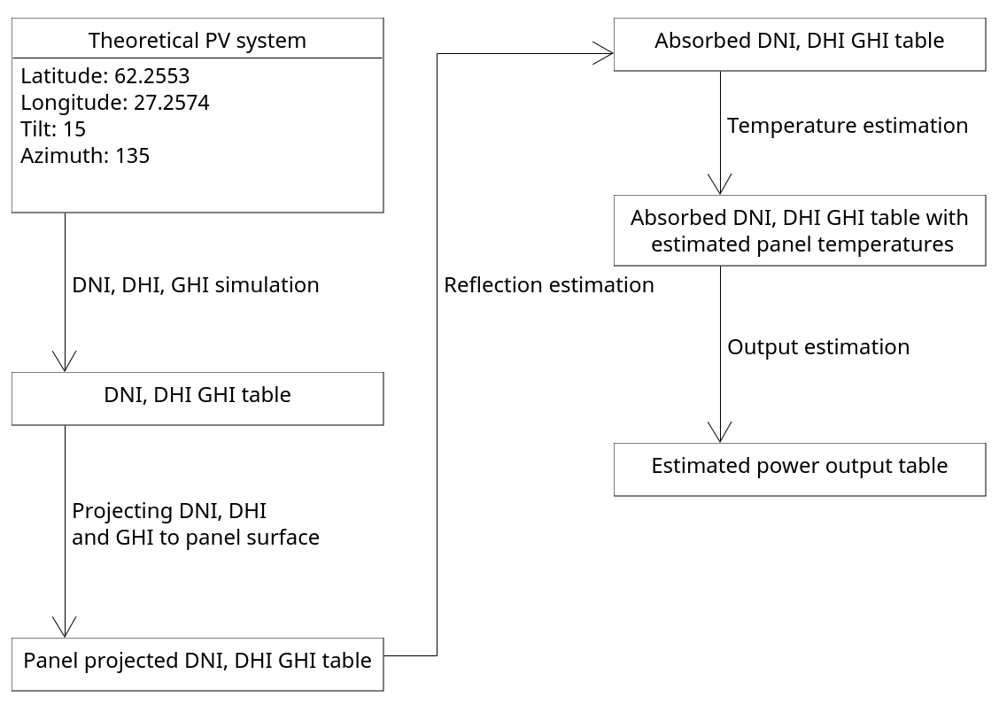

# FMI Open PV Forecast
**Last update 2024-10-09**

## Description
Python code for predicting the output from a solar PV installation at given coordinates and panel installation angles. 
FMI Open Data weather forecast is taken as input for the PV calculations. The intention of this project is to offer a 
configurable solar PV forecast model for PV installation operators within Finland. MIT License allows for commercial and 
non-commercial usage.

The tool is based on research by the international scientific community, in addition to specific studies done at FMI: 
- PV estimation model as described by Huld et al. (2010) and utilized also by the Joint Research Centre’s PVGIS 
service (https://re.jrc.ec.europa.eu/pvg_tools/en/)
- PV related tools available in the PVlib Python package
- Testing this PV model and Numerical Weather Prediction based PV forecasting in Finnish conditions (Böök et al., 2020; Böök & Lindfors, 2020)

## Features
- Adjustable simulation parameters:
    - Geolocation (FMI Open Data available for a limited are shown in https://en.ilmatieteenlaitos.fi/numerical-weather-prediction).
    - Panel angles.
    - Temporal resolution.
    - Installation size.
    - Wind speed and air temperature.
- The model takes into account the following radiation sources:
  - Direct radiation. Modeled with DNI (Direct Normal Irradiance).
  - Atmosphere scattered radiation. Modeled with DHI (Diffuse Horizontal radiance).
  - Ground reflected radiation. Modeled with GHI (Global Horizontal Irradiance).
- Losses and efficiency variation due to:
  - Panel reflectivity.
  - Panel temperature (including panel temperature modeling based on weather data from FMI Open Data).
  - Variable ground albedo (with FMI Open Data).
  - Atmopsheric aerosols and ozone (with FMI Open Data).

- Plotting:
    - PVlib based clear sky energy output forecast.
    - FMI Open Data based weather forecast-aware energy output forecast.
    - Combined plotting:
      - Shows the theoretical maximum generation and weather-model-based generation side by side.
      - Estimates kWh generation per day.
- Exporting:
  - Output and irradiance data can be exported as a .CSV -file by setting save_csv to True in config.py 

## Software requirements:
Python version: >=3.11

Python packages:
* fmiopendata >=0.4.3
* matplotlib >=3.9.2
* numpy >=2.1.1
* pandas >=2.2.2
* pvlib >=0.11.0


## Generating a new plot
1. First adjust parameters in config.py to match the simulated PV installation. Important parameters are geolocation, panel angles
and rated power. Other parameters such as module elevation, wind speed and air temperature can be used for fine-tuning.

2. Run function combined_processing_of_data() inside file main.py. This function will execute by default if main.py is not modified.

3. Open generated plot from folder "output". Path to file should be similar to "output/FMI Helsinki-2024-06-03 08:03.png"


## Reading the plot


Simulated PV output should resemble the following picture. Dark blue line marks the weather-model-based generation in both
line and bar charts, whereas the lighter blue corresponds to a theoretical cloud-free power output estimate.

Dashed vertical line (1) marks the simulation runtime. This time is the same as the timestamp in plot title.

During predicted cloudy or partially cloudy days(2) the weather-model-based generation is lower than theoretical cloud-free generation.

During predicted cloud-free days(3) both estimates should be within a small margin of one another. 
The deviation between models can increase depending on aerosol load of the atmosphere, 
water vapor and total ozone column, and other factors potentially influencing the solar radiation reaching the assumed PV installation.

Weather-model-based DNI, DHI, GHI are available from FMI Open Data for a 66-hour period from the initial time of the model run. 
This means that the line for estimated output stops on either 3rd or 4th day depending on simulation runtime. 
Stopping point marked as (4). The code uses MetCoOp numerical weather prediction available through FMI Open Data. 
Forecast initial times are 00 UTC, 03 UTC, 06 UTC, and so on, and a new forecast typically becomes available around three hours after the initial time.  

The bar chart contains a comparison of theoretical cloud-free and theoretical clear sky PV output. 
In (5) the estimated PV output is marked as 114kWh,
which is 69% of the ~165kWh power generation estimated by the clear sky model. 
This estimate is calculated based on the data period available from FMI Open Data, meaning that power generation before 
simulation runtime(1) is included in the data for the first day.

**Notes:** 
- The forecast represents a somewhat ideal monofacial PV system, with a perfect open horizon, standard assumed losses and no snow accumulated on the panels. Real PV systems may deviate from this for various reasons. Such reasons include, for example:
  - Shadows cast by trees and other structures.
  - Snow on top of the panels decreasing the PV production.
  - System-specific losses aren't accounted for properly.
- Weather forecasts are uncertain to some extent.
- FMI Open Data values are expected hourly averages.
- The forecast has been tested on real PV data from FMI’s Helsinki and Kuopio sites. 
Some comparison plots are available in directory /documentation_picture/measured_vs_forecasted. 
These installations are located on flat rooftops without major shadowing. 
The results show good agreement with actual PV output during cloud-free days. For cloudy days, the forecast is typically more uncertain, but still fairly good.
- The PV efficiency model (Huld model) can produce negative efficiency values when irradiance is low. This was remedied by setting an efficiency limit in ouput_estimator.py.

---

## Troubleshooting

**Issue:** 

Simulated generation is higher than the real output of my system.

**Solutions:**
  * Check that system power rating and panel angles are correct in config.py
  * PV panels degrade over time -> Adjust rated_power in config.py to be a lower value.
  * Panels may be dusty -> Wash panels or wait for rain to do it for you.
  * Wind may cool the panels less than the model suggests, and the increased temperature may be decreasing efficiency. -> Set a lower than actual module elevation in
config.py


**Issue:**

Real generation is higher than simulated output.

**Solutions:**
  * Check that system power rating and panel angles are correct in config.py
  * Reflections from clouds can increase PV output if direct sunlight is not blocked. -> No changes needed, this is just challenging to model, and this should not occur often.
  * Real panel temperature might be colder than modeled panel temperature. -> No solutions. This would require model adjustments.

**Issue:**

I am using bifacial panels or panels with multiple installation angles, and the program does not appear to support my system.

**Solution:**

Adding support for bifacial and mixed angle installations would be fairly easy, and may be added in the future if requested. Reach out to us and we'll consider adding support.


___
# Advanced usage
The code has been commented and structured so that it should be easy to modify as needed. Everything after this line is meant to describe the inner logic of the project for advanced users. For additional questions, create a new issue at project github page or reach out to us.

___

## Terminology    
* Irradiance: Solar radiation per m², measured in watts.
* DNI: Direct Normal Irradiance, direct sunlight reaching the point of interest without being scattered or absorbed in the atmopshere. Imagine the irradiance at the bottom of a long tube pointing towards the Sun.
* DHI: Diffuse Horizontal Irradiance, indirect sunlight scattered from the atmosphere. Complement of DNI. Imagine system which blocks direct sunlight from reaching the point of interest, but does not block any irradiance from other segments of the sky.
* GHI: Global Horizontal Irradiance. Sum of DNI (projected to a horizontal surface) and DHI.
* Irradiance transpositions: Irradiance types have to be projected to the panel surface. Functions for each irradiance type are different.
* Reflection loss estimation: Solar panel surfaces reflect a proportion of solar irradiance away from solar panels. These reflective losses depend on the angle at which irradiance reaches the panel surface. Irradiance - Reflected irradiance = Absorbed irradiance.
* Temperature estimation: Solar panel efficiency is influenced by panel temperatures. Panel temperatures can be estimated based on absorbed radiation and assumed air temperature.
* AOI/Angle of incidence: Angle between solar panel normal and direct sunlight.

## PV model flowchart


The PV model used by this program works according to the figure above. In theoretical clear sky PV generation simulations,
the DNI, DHI, GHI table comes from PVlib simulations whereas in weather model based simulations this same table is fetched from FMI Open Data.

After the DNI, DHI, GHI-tables are ready, both theoretical and weather model based DNI,
DHI and GHI are processed through the same pipeline.


### Code files and flowchart steps

- DNI, DHI, GHI simulation simulation: solar_irradiance_estimator.py, _meps_data_loader.py , meps_data_parser.py
- Projecting DNI, DHI and GHI: irradiance_transpositions.py
- Reflection estimation: reflection_estimator.py
- Temperature estimation: panel_temperature_estimator.py
- Output estimation: output_estimator.py

<!-- 


## Program structure
* astronomical_calculations.py
    * Used for calculating sunlight angles, required for irradiance transpositions.
* config.py
    * Stores installation specific variables such as geolocation, ground albedo, timezone and so on.
* irradiance_transpositions.py
    * Contains functions for projecting the three simulated irradiance components DNI, DHI, GHI to the surface of solar panels.
* main.py
    * Controls the system. Avoid writing complex code here. The file contains samples on how to operate the forecaster.
* panel_temperature_model.py
    * Solar PV module temperature estimation equations. Physically accurate, require ambient temperature, panel elevation from ground and wind speed values.
* plotter.py
    * Functions for plotting visualizations.
* reflection_estimator.py
    * Functions for estimating how much of the irradiance which hits solar panel surfaces is absorbed and not reflected away.
* solar_irradiance_estimator.py
    * Estimates solar irradiance based on given model name. Supports clear sky and weather prediction-based estimates.

**Data Flow:**
1. Use solar_irradiance_estimator.py to generate a dataframe with dni, dhi, and ghi values.
These represent different types of irradiance which is radiated towards solar panels.

2. Use irradiance_transpositions.py to estimate how dni, dhi, and ghi are projected to solar panel surfaces. These surface projected values are stored as dni_poa, dhi_poa, ghi_poa and their sum poa.
3. Use reflection_estimator.py to estimate how much of dni_poa, dhi_poa, ghi_poa is absorbed by solar panels and how much is reflected away. Store the sum as poa_refl_cor.


**Resulting dataframe structure:**

 | time                       |   dni    |    ghi   |    dhi  |   dni_poa  | ghi_poa |  dhi_poa  |   poa  | poa_ref_cor|
|----------------------------|----------|----------|---------|------------|---------|-----------|--------|------------|
| 2023-10-13 00:00:00+03:00  |    0.00  |    0.00 |    0.00  |     0.00   |    0.00  |     0.00   |    0.00    |     0.00|
| 2023-10-13 00:15:00+03:00  |    0.00  |    0.00 |      0.00 |      0.00  |     0.00  |     0.00   |    0.00   |      0.00|
| 2023-10-13 00:30:00+03:00  |    0.00  |    0.00 |      0.00 |      0.00  |     0.00  |     0.00   |    0.00   |      0.00|
| 2023-10-13 00:45:00+03:00  |    0.00  |    0.00 |      0.00 |      0.00  |     0.00  |     0.00   |    0.00   |      0.00|
|  2023-10-13 01:00:00+03:00 |    0.00  |    0.00 |      0.00 |      0.00  |     0.00  |     0.00   |    0.00   |      0.00|

-->


## Code samples
### Pvlib data processing function:
```python
# This function is located in main.py
def get_fmi_data(day_range= 3):
    # date for simulation:
    today = datetime.date.today()
    date_start = datetime.datetime(today.year, today.month, today.day)

    # step 1. simulate irradiance components dni, dhi, ghi:
    data = solar_irradiance_estimator.get_solar_irradiance(date_start, day_count=day_range, model="fmiopen")

    # step 2. project irradiance components to plane of array:
    data = helpers.irradiance_transpositions.irradiance_df_to_poa_df(data)

    # step 3. simulate how much of irradiance components is absorbed:
    data = helpers.reflection_estimator.add_reflection_corrected_poa_components_to_df(data)

    # step 4. compute sum of reflection corrected components:
    data = helpers.reflection_estimator.add_reflection_corrected_poa_to_df(data)

    # step 5. estimate panel temperature based on wind speed, air temperature and absorbed radiation
    data = helpers.panel_temperature_estimator.add_estimated_panel_temperature(data)

    # step 6. estimate power output
    data = helpers.output_estimator.add_output_to_df(data)

    return data
```

### PVlib and FMI Open Data plotting:
```python
# This function is located in main.py
def combined_processing_of_data():
    """
    Uses both pvlib and fmi open to compute solar irradiance for the next 4 days and plots both
    :return:
    """

    # helper functions:
    data_pvlib = get_pvlib_data(4)
    data_fmi = get_fmi_data(4)

    print_full(data_fmi)
    print_full(data_pvlib)
    
    # mono plotting
    plotter.plot_fmi_pvlib_mono(data_fmi, data_pvlib)

```

### Changes 2024-10-09:
- Initial open source publication.


### TODO:
* Bifacial/multi angle support if requested by users.
* Timezone conversions.
* Wind speed and air temperature biases for local adjustments.

## MIT License

Copyright 2024 Ilmatieteen laitos(Finnish Meteorological Institute)

Permission is hereby granted, free of charge, to any person obtaining a copy of this software and associated documentation files (the “Software”), to deal in the Software without restriction, including without limitation the rights to use, copy, modify, merge, publish, distribute, sublicense, and/or sell copies of the Software, and to permit persons to whom the Software is furnished to do so, subject to the following conditions:

The above copyright notice and this permission notice shall be included in all copies or substantial portions of the Software.

THE SOFTWARE IS PROVIDED “AS IS”, WITHOUT WARRANTY OF ANY KIND, EXPRESS OR IMPLIED, INCLUDING BUT NOT LIMITED TO THE WARRANTIES OF MERCHANTABILITY, FITNESS FOR A PARTICULAR PURPOSE AND NONINFRINGEMENT. IN NO EVENT SHALL THE AUTHORS OR COPYRIGHT HOLDERS BE LIABLE FOR ANY CLAIM, DAMAGES OR OTHER LIABILITY, WHETHER IN AN ACTION OF CONTRACT, TORT OR OTHERWISE, ARISING FROM, OUT OF OR IN CONNECTION WITH THE SOFTWARE OR THE USE OR OTHER DEALINGS IN THE SOFTWARE.


## References

**Irradiance simulation: PVlib** -- https://pvlib-python.readthedocs.io Anderson, K., Hansen, C., Holmgren, W., Jensen, A., Mikofski, M., and Driesse, A. “pvlib python: 2023 project update.” Journal of Open Source Software, 8(92), 5994, (2023). DOI: 10.21105/joss.05994.

**Solar radiation forecasts: FMI Open Data** https://en.ilmatieteenlaitos.fi/open-data-manual-forecast-models


**Irradiance projection: Perez diffuse sky model** -- https://pvpmc.sandia.gov/modeling-guide/1-weather-design-inputs/plane-of-array-poa-irradiance/calculating-poa-irradiance/poa-sky-diffuse/perez-sky-diffuse-model/ -- 
Perez, R., Seals, R., Ineichen, P., Stewart, R., Menicucci, D., 1987. A new simplified version of the Perez diffuse irradiance model for tilted surfaces. Solar Energy 39(3), 221-232.
Physical processing pipeline contains multiple steps

**Irradiance projection: Ground reflections** -- https://pvpmc.sandia.gov/modeling-guide/1-weather-design-inputs/plane-of-array-poa-irradiance/calculating-poa-irradiance/poa-ground-reflected/

**Irradiance projection: Direct sunlight** -- https://pvpmc.sandia.gov/modeling-guide/1-weather-design-inputs/plane-of-array-poa-irradiance/calculating-poa-irradiance/poa-beam/

**Panel reflection estimation: Martin And Ruiz 2001 model**
Chivelet M., Nuria, Ruiz J.M. _Calculation of the PV modules angular losses under field conditions by means of an analytical model_. Solar Energy Materials and Solar Cells,
Volume 70 (2001),
pp. 25-38.

**Panel temperature estimation: King 2004 model**
D.~King, J.~Kratochvil, and W.~Boyson,
 Photovoltaic Array Performance Model Vol. 8, ,
PhD thesis (Sandia National Laboratories, 2004).


**PV system output: Huld 2010 model** --
T.~Huld, R.~Gottschalg, H.~G. Beyer, and M.~Topič,
Mapping the performance of PV modules, effects of module type and
  data averaging, Solar Energy, 84 324--338 (2010).


## Additional thanks
Viivi Kallio for writing FMI open data forecast retrieval code.

William Wandji for helping with the irradiance processing pipeline.

